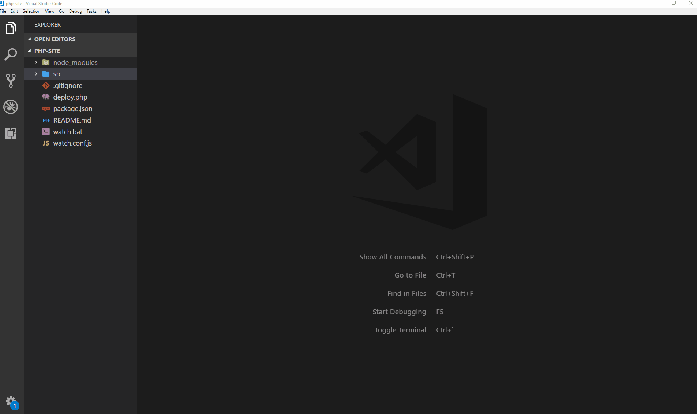

# PHP-Watcher
Watch PHP files and execute a corresponding handler.

## Prerequisites
Node.js Version >= 8 (might work with older versions, but untested). You can find latest version 8 [here](https://nodejs.org/download/release/v8.11.2/).

## Install
```
npm install
```

## Usage
```
npm start
```

## Configuration
Create a `js` module and export a config object according to API options below. All options are merged with their defaults, so you can spare an option if its default is already covering your needs. Defaults:
```js
module.exports = {
  php: 'C:/php',
  command: 'deploy.php',
  watchDir: 'php',
  watchOptions: {
    ignored: /(^|[/\\])\../,
    persistent: true
  },
  verbose: true
}
```
Then, pass it to `php-watcher`, like so:
```
node ./node_modules/php-watcher/index.js --conf=watch.conf.js
```
Ideally, you can assign this command to `npm` script, like so:
```json
{
  "scripts": {
    "watch": "node ./node_modules/php-watcher/index.js --conf=watch.conf.js"
  }
}
```
Then, use it:
```
npm run watch
```

## Options

#### `php`
* Type: `String`
* Default: `C:/php`
* Description: Absolute path to PHP service.

#### `command`
* Type: `String`
* Default: `deploy.php`
* Description: Command to execute on watch callback.

#### `watchDir`
* Type: `String`
* Default: `php`
* Description: Relative path to watched files.

#### `watchOptions`
* Type: `Object`
* Default:
```
{
  ignored: /(^|[/\\])\../,
  persistent: true
}
```
* Description: See options [here](https://github.com/paulmillr/chokidar#api).

#### `verbose`
* Type: `Boolean`
* Default: `true`
* Description: Whether to display handler output or not.

## Preview

